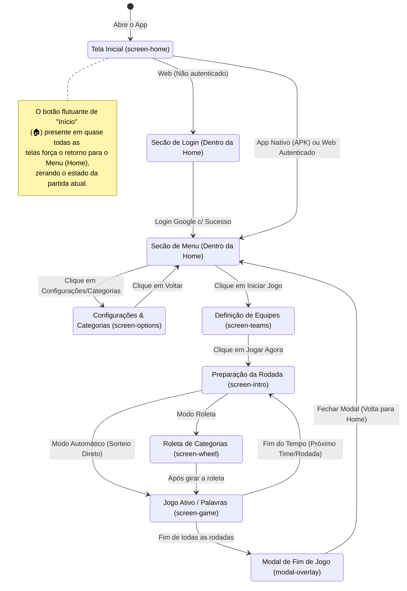

# Diagrama de Telas e Fluxo do Usuário - Palavra na Testa

Este documento mapeia a jornada do jogador através das telas (screens) do aplicativo, desde a autenticação até o fim do jogo.
É útil para planejar alterações de UI/UX e entender como a classe `app.to('id')` interliga as diferentes fases do jogo.

## Fluxograma Principal

## Descrição das Telas no Código (`index.html`)

- **`#screen-home`**: A tela principal unificada. Carrega a logo, exibe `#home-auth-section` se necessitar de verificação de permissão no YouTube (Brotherzaço), ou `#home-menu-section` se o acesso estiver liberado.
- **`#screen-options`**: Tela com abas (Tabs) para controlar as Regras do Jogo, Áudio, e gerenciar/importar Categorias.
- **`#screen-teams`**: Onde o usuário define o nome dos times (ou apenas um time no modo Solo) antes de começar oficialmente.
- **`#screen-intro`**: Tela de transição (`prepara!`) que anuncia qual time vai jogar agora e em qual rodada estamos.
- **`#screen-wheel`**: Animação em canvas da roleta sorteando a categoria.
- **`#screen-game`**: A tela principal de gameplay contendo a carta com a palavra, o temporizador e detectores de movimento (acertou/pulou).
- **`#modal-overlay`**: Modal genérico usado para avisos, mas principalmente usado para mostrar o placar final quando as rodadas acabam.
